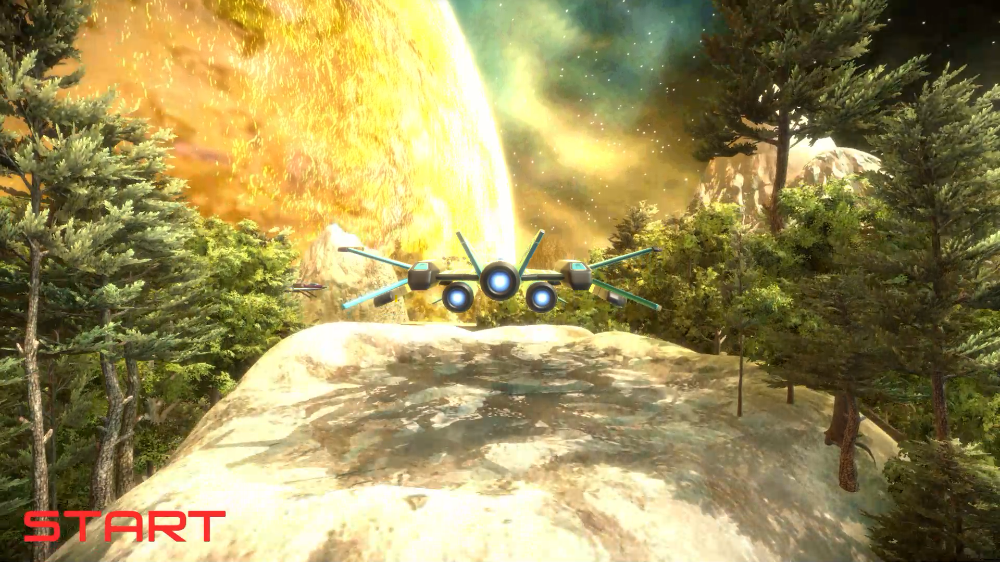
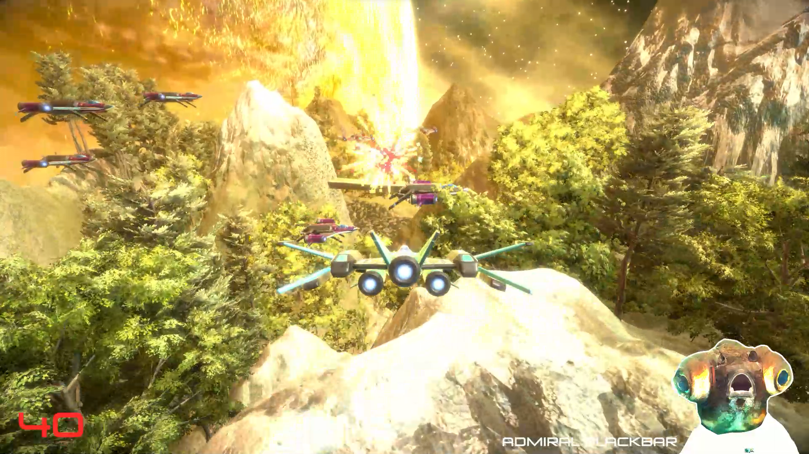
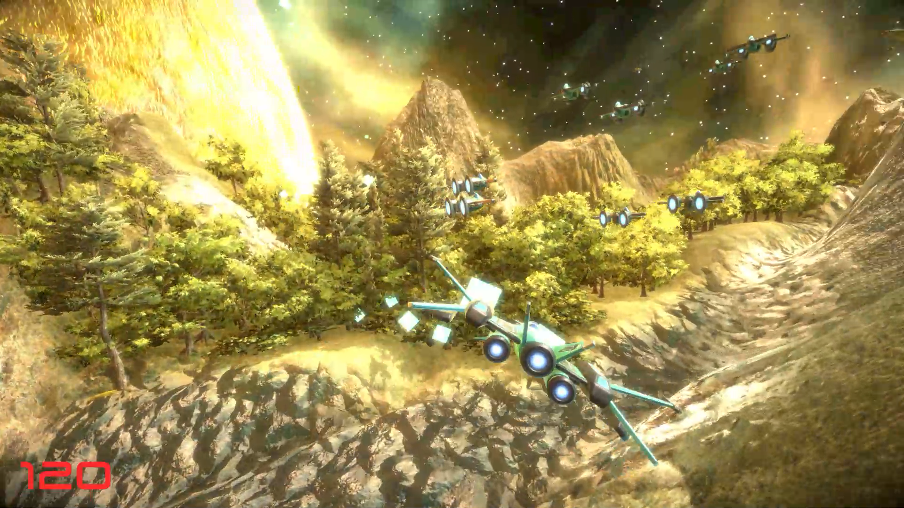
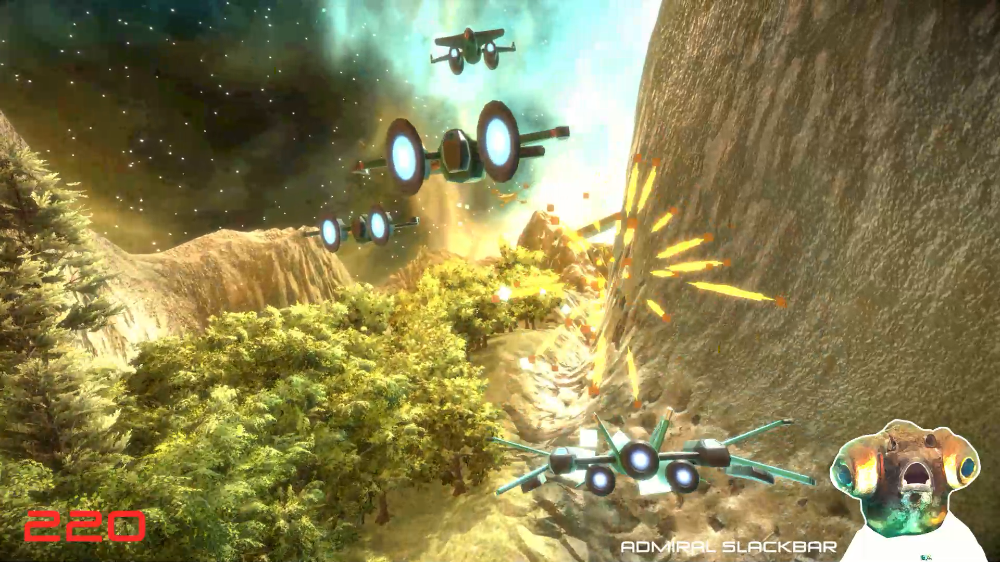
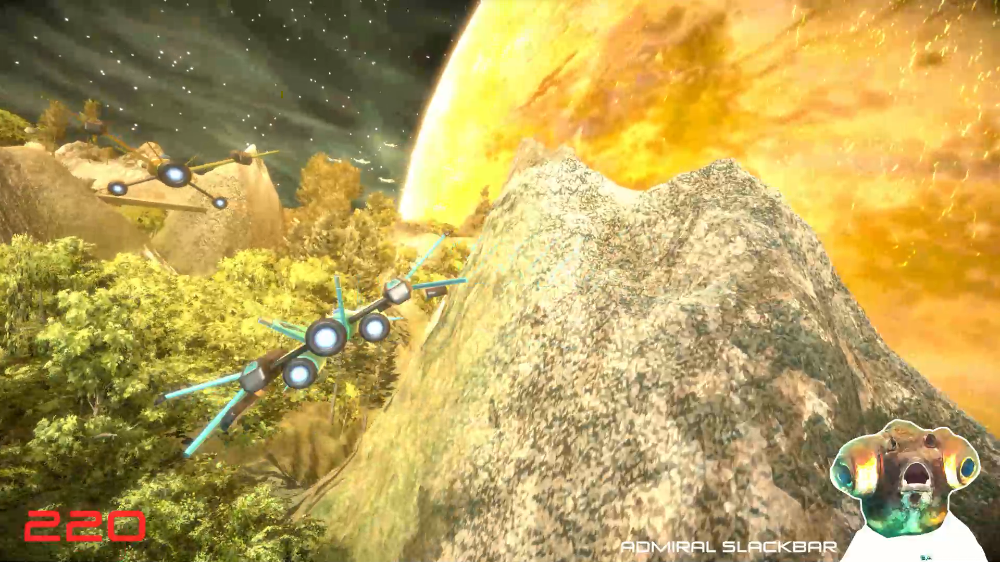
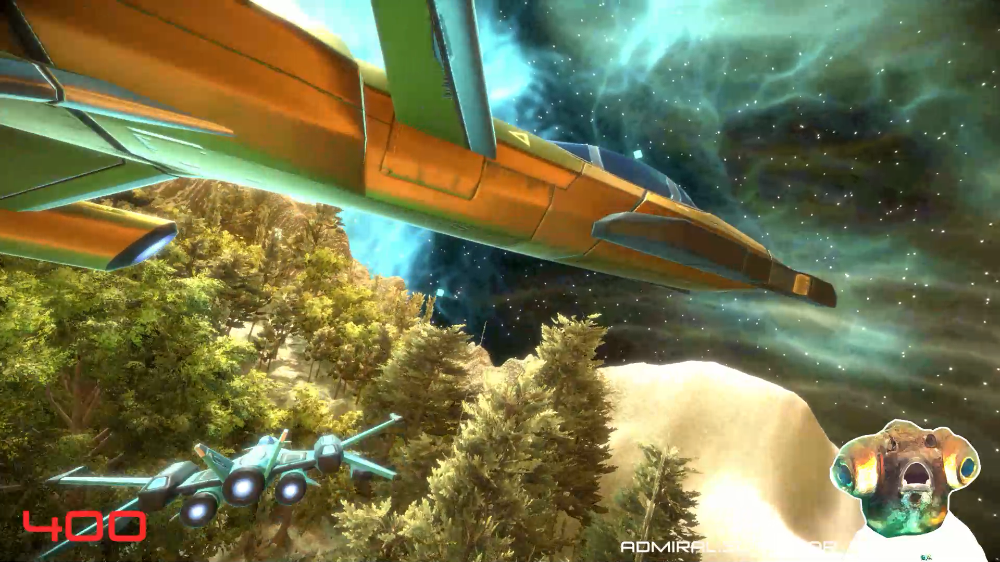

# Argon Assault

### Introduction
    Realm Rush is a rail shooter game in which the player controls a ship that can fire laser bullets. The 
    player guides the ship to avoid obstacles and destroy enemies by shooting them.

### Features
    - Intuitive and Responsive Controls:
        - Easy-to-use controls for smooth navigation and shooting.
        - Skillfully maneuver the ship with pitch, yaw, and roll controls, ensuring responsive and precise 
          control.
        
     - Cinematic Enemy Ship Arrival:
        - Experience cinematic moments as enemy ships elegantly enter the scene, enhanced with Unity's Timeline
          for a visually engaging gameplay experience.
          
     - Dynamic Level Design: 
        - Well-crafted levels with dynamic environments, including enemy ships firing missiles and large enemy 
          ships incoming.
        - Spacious vibes and immersive sound effects to enhnace the overall atomsphere.
    
### Screenshots

   
   
   
   
   
   
   

   
### Implementation and Game Design
#### Implementation
##### Scripts
    - PlayerControls: Responsible for controlling a ship's movement and rotation based on input, enabling 
             and disabling a set of laser guns based on player input.
    
    - Enemy: It handles the enemy's hit points, visual effects upon being hit, and its destruction,
             including score updates when killed.
                  
    - CollisionHandler: Triggers a crash sequence on collision, disabling the player's visuals and controls 
             temporarily, and reloading the level after a delay.
             
    - ScoreBoard: Manages a score system. The score increases based on the specified amount.
    
    - MusicPlayer: Ensures a single instance of MusicPlayer, destroying extras during Awake to prevent
              duplication across scene changes.

 
 #### Game Design
     - Designed strategic level using provided assets.
       
#### Focus
    - Learn Unity's Terrain component to create terrain, utilize terrain tools, and apply texturing and trees.
    - Learn Unity's Timeline for creating cinematic scenes, such as the entrance of enemies as the player enters 
      a specific area.
    - Learn about quaternions for rotation, including pitch, yaw, and roll.
    - Become familiar with using a Particle System for firing laser bullets.
    
### Gameplay Demonstration
    - For a visual demonstration of the gameplay, watch video on YouTube:
 [Youtube video link](https://youtu.be/iecopYTLx58)

### Play the Game
    - To experience the game firsthand, play it directly by following this playable link:
[Play in browser(WebGl)](https://rahul-pargi.itch.io/argon-assault)
